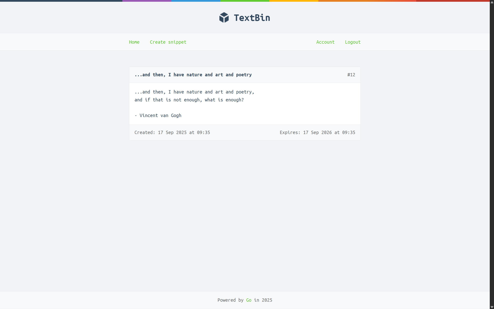

# TextBin

TextBin is a web application written in Go and MySQL for sharing and managing text snippets. Users can view public snippets, create new ones after logging in, and set expiration times for their snippets.

## Screenshots





## Features

- **View Snippets:** Home page displays the latest 10 snippets.
- **Create Snippets:** Authenticated users can create new snippets.
- **Snippet Expiry:** Set snippet expiration to one day, one week, or one year.
- **User Authentication:** Session-based login system.
- **Update Password:** Users can update their password after logging in.
- **HTTPS Support:** Runs as an HTTPS server using provided certificate and key files.
- **Template Caching:** Caches HTML templates for performance.
- **Embedded Assets:** Uses Go’s `embed` package to bundle static files and templates into the binary.
- **Debug Mode:** Optional debug mode for detailed error messages.
- **Testing:** Includes tests for handlers, middleware, and templates. Database operations are mocked for testing.

## Technologies Used

- Go standard `net/http` library
- Go `embed` package
- Session management
- HTTPS with TLS certificates
- MySQL

## Getting Started

### Prerequisites

- Go 1.24 or newer
- MySQL 
- TLS certificate and key files

### Running the Application

1. Clone the repository:
    ```sh
    git clone https://github.com/Rif-7/text-bin.git
    cd text-bin
    ```

2. Set up the database by running the provided schema file (make sure MySQL is running and update the password in `schema.sql` if needed):
    ```sh
    mysql -u root -p < schema.sql
    ```

3. Make sure you have TLS certificate and key files at `./tls/cert.pem` and `./tls/key.pem`.  
   You can generate self-signed certificates for development with:
    ```sh
    mkdir -p tls
    openssl req -x509 -newkey rsa:4096 -keyout tls/key.pem -out tls/cert.pem -days 365 -nodes -subj "/CN=localhost"
    ```

4. Build and run:
    ```sh
    make run
    ```

5. Visit [https://localhost:4000](https://localhost:4000) in your browser.

### Running Tests

```sh
make test
```

## Advanced Setup

You can customize the application's behavior using command-line flags:

- `-addr`  
  Set the HTTP network address (default: `127.0.0.1:4000`).
- `-dsn`  
  Set the MySQL data source name (default: `web:pass@/snippetbox?parseTime=true`).
- `-debug`  
  Enable debug mode for more detailed error messages (default: `false`).

### Example

```sh
go run ./cmd/web -addr="0.0.0.0:8080" -dsn="web:yourpass@/snippetbox?parseTime=true" -debug=true
```

## Project Structure

- `cmd/web/` – Main application entry point, handlers, routes, middleware
- `internal/models/` – Database models and mocks for testing
- `internal/assert/` – Test helpers
- `internal/validator/` – Form validation logic
- `ui/` – Embedded static assets and HTML templates
- `tls/` – TLS certificate and key files

## License

MIT License

---

*This project is for educational purposes and demonstrates secure session management, template caching, and Go web development best practices.*